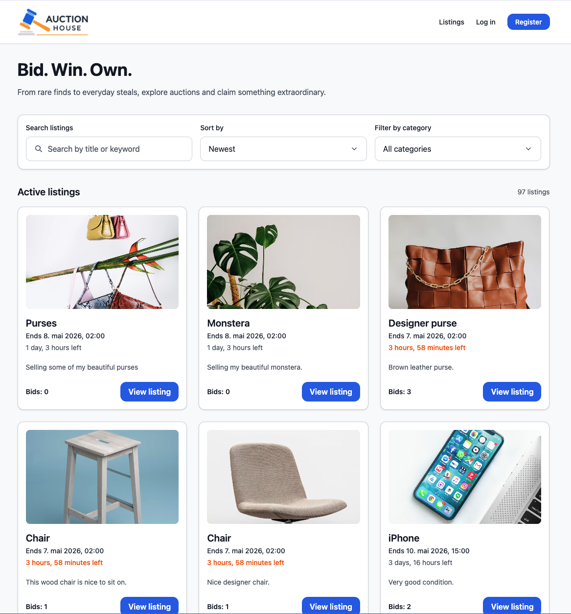
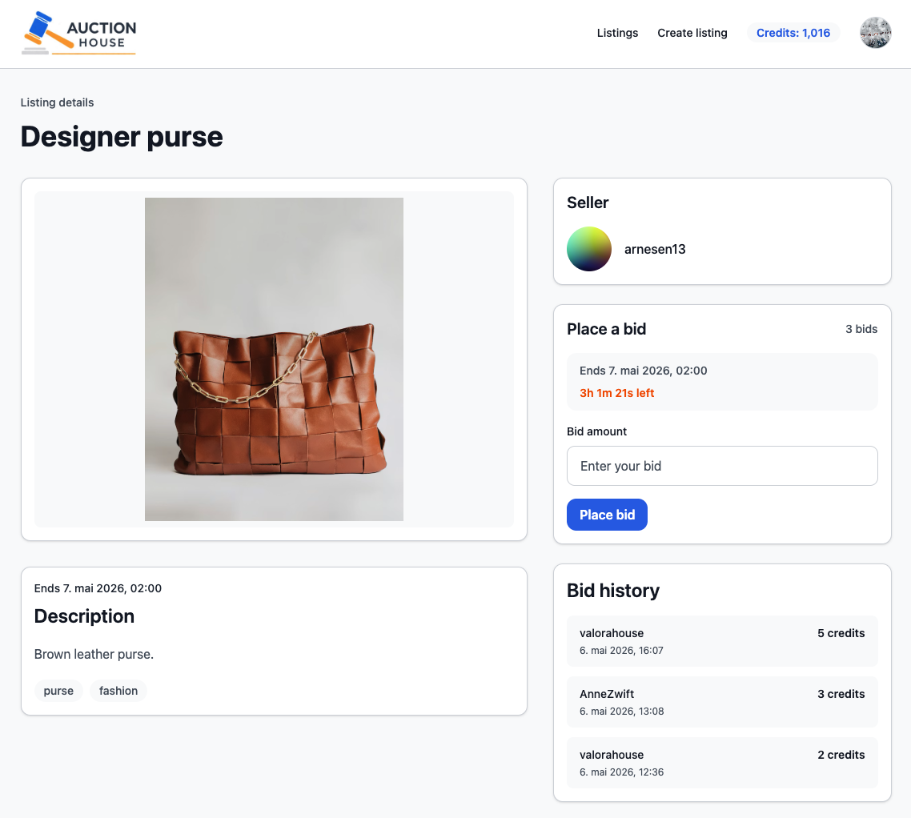
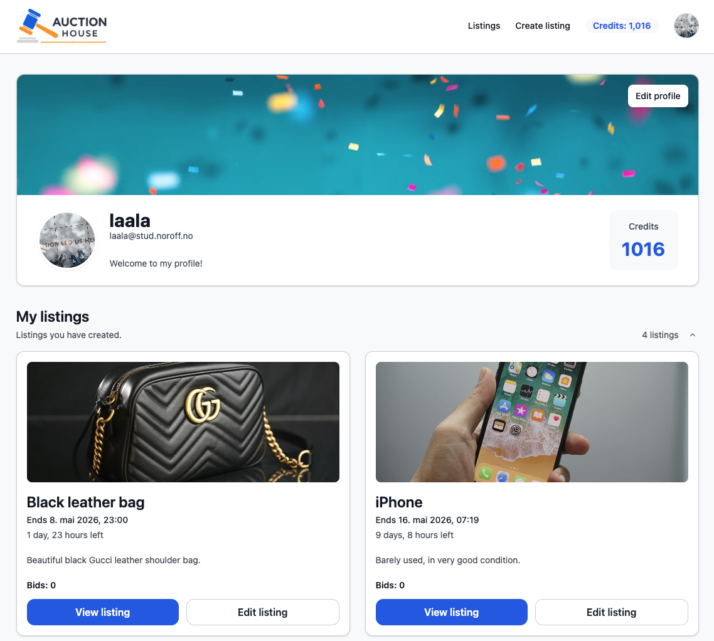
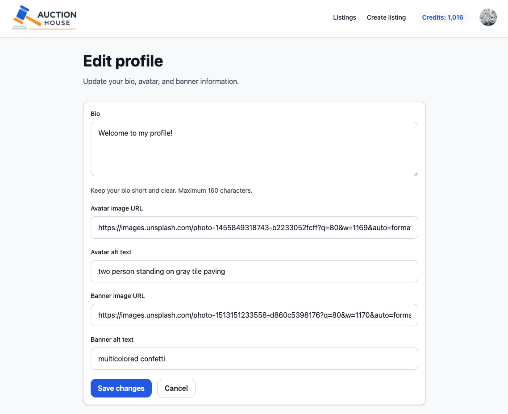

# Semester Project 2 – Auction House

Auction House is a multi-page auction web application built with **Vite**, **TypeScript**, and **Tailwind CSS**, using the **Noroff Auction House API**. The application allows users to register, log in, create and manage auction listings, place bids, and update their profile.



## Live site

[Live Demo](https://hallsi90-fed2-sp2-auction-house.netlify.app/)

## Repository

[GitHub Repository](https://github.com/hallsi90/FED2-semester-project-2)

---

## Description

This project was built as Semester Project 2. The goal was to develop a responsive front-end application for the Noroff Auction House API, where users can register, create listings, place bids, and take part in auctions through a dynamic and interactive user experience.

The project focused on planning, developing, and documenting a high-quality front-end solution that integrates with the provided back-end API. The application supports both visitors and authenticated users, with features for browsing listings, managing auctions, and updating profile information.

### Visitors can:

- browse active listings
- search, sort, and filter listings
- view single listing details
- register an account

### Authenticated users can:

- log in
- log out
- view their profile
- edit their profile
- view their credit balance
- create listings
- edit and delete their own listings
- view listings they have created
- view other users' listings
- place bids on other users’ listings
- view listings they have bid on
- view won listings
- view other users' profiles

---

## Built with

- [Vite](https://vitejs.dev/)
- [TypeScript](https://www.typescriptlang.org/)
- [Tailwind CSS](https://tailwindcss.com/)
- [Noroff Auction House API](https://docs.noroff.dev/docs/v2)

---

## Features

- Multi-page application setup with Vite
- Authentication with register and login
- API key creation and authenticated requests
- Public listings overview page
- Search, sort, and category filtering
- Single listing view with bid history and image gallery
- Create listing page with dynamic image fields and previews
- Edit listing page with update and delete functionality
- Profile page with collapsible sections
- Edit profile page
- Shared loading, empty, error, and protected-page states
- Responsive layout for mobile, tablet, and desktop
- Reusable components and centralized route/constants setup

---

## More screenshots

### Single listing page



### Profile page



### Edit profile page



---

## Project structure

```text
FED2-semester-project-2/
├── docs/
│   ├── ai-usage-log.md
│   ├── api-test-notes.md
│   └── images/
├── listing/
│   ├── create/
│   ├── edit/
│   └── index.html
├── login/
│   └── index.html
├── profile/
│   ├── edit/
│   └── index.html
├── public/
│   └── favicon.ico
├── register/
│   └── index.html
├── src/
│   ├── api/
│   ├── assets/
│   ├── components/
│   ├── constants/
│   ├── entries/
│   ├── pages/
│   ├── types/
│   ├── utils/
│   └── style.css
├── .gitignore
├── index.html
├── package-lock.json
├── package.json
├── README.md
├── tsconfig.json
└── vite.config.ts
```

---

## Getting started

1. Clone the repository

```bash
git clone https://github.com/hallsi90/FED2-semester-project-2.git
```

2. Navigate to the project folder

```bash
cd FED2-semester-project-2
```

3. Install dependencies:

```bash
npm install
```

---

## Running the project

Start the development server:

```bash
npm run dev
```

Build for production:

```bash
npm run build
```

Preview production build:

```bash
npm run preview
```

---

## TypeScript check

The project uses TypeScript checks as part of the build process.

```bash
npx tsc --noEmit
```

---

## API

This project uses the Noroff Auction House API.

Main endpoints used:

- POST /auth/register
- POST /auth/login
- POST /auth/create-api-key
- GET /auction/listings?\_active=true
- GET /auction/listings/{id}?\_seller=true&\_bids=true
- POST /auction/listings
- PUT /auction/listings/{id}
- DELETE /auction/listings/{id}
- POST /auction/listings/{id}/bids
- GET /auction/profiles/{name}
- GET /auction/profiles/{name}?\_wins=true
- GET /auction/profiles/{name}/listings
- GET /auction/profiles/{name}/bids?\_listings=true
- PUT /auction/profiles/{name}

---

## Technical choices

**Vite multi-page setup**
This project uses Vite as a multi-page application instead of a single-page application. Each page has its own HTML entry and TypeScript entry file.

**TypeScript and reusable structure**
TypeScript was used to create shared types, reusable API helpers, route constants, storage helpers, validation functions, and UI/state components.

**Tailwind CSS**
Tailwind CSS was used for styling, with reusable class groups stored in shared UI objects for consistency across pages.

**Shared states**
The application includes reusable UI for:

- loading states
- empty states
- page-level error states
- protected page states

---

## Accessibility and usability considerations

This project includes:

- semantic HTML structure
- form labels and helper text
- field-level validation messages
- aria-live regions for dynamic messages
- keyboard-accessible buttons and controls
- focus states for interactive elements
- responsive layouts across screen sizes

---

## Testing and quality checks

The final project review included:

- repeated production builds using npm run build
- TypeScript checks
- manual testing of page flows and linked features
- testing responsive layouts across screen sizes
- W3C HTML validation
- W3C CSS validation
- WAVE accessibility testing
- Lighthouse testing on all pages
- readability and DRY cleanup
- review of loading, empty, and error states
- removal of debugging code and console logs

---

## Known limitations

- Category filters are currently hardcoded rather than generated dynamically from listing tags
- Footer links and newsletter form are present as UI elements only

---

## Future improvements

- Add full keyboard focus trapping to the delete confirmation modal
- Add pagination or load-more functionality for listings
- Expand profile statistics and activity views

---

## Documentation

The repository also includes supporting project documentation in the docs folder:

- `docs/api-test-notes.md`
- `docs/ai-usage-log.md`

---

## Credits

Developed by Ingelinn Hallseth as part of Semester Project 2.

---

## Contact

**Ingelinn Hallseth:**
ingelinn@hotmail.com

---

## Acknowledgements

- Noroff for the assignment brief and provided Auction House API
- Noroff documentation for API reference and implementation support
- ChatGPT was used as a support tool during planning, implementation discussions, debugging, testing review, and documentation. Specific usage is documented in `docs/ai-usage-log.md`
